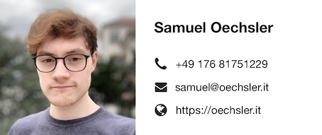

# Resume

Hi, I'm Sam. Currently, I'm a computer science student at the Baden-Württemberg Cooperative State University (DHBW) 
in Karlsruhe. Prior to that I've been dreaming in code since pretty much the beginning of the last decade and thus have
gained roughly eight years now of *personal experience* in coding with various technologies and languages, something I 
always like to dedicate some of my free time to. Whilst studying I have also gained roughly two years of experience in 
the industry now working at medialesson GmbH in Pforzheim. 

## Languages

- German &minus; native
- English &minus; fluent

## Education

- 2018 &minus; *now** &emsp;&emsp; Bachelor of Science in Applied Computer Science at Cooperative State University (DHBW) 
- 2011 &minus; 2018 &emsp; Abitur at the Lise-Meitner Gymnasium in Königsbach-Stein
- 2009 &minus; 2011 &emsp; Reuchlin Gymnasium Pforzheim
- 2005 &minus; 2009 &emsp; Elmentary School Eisingen

## Experience

### Tech related

- 2015 &emsp; BOGY internship at medialesson GmbH in Pforzheim
- 2014 &emsp; Internship at SYZYGY in Bad-Homburg

- 2014 &emsp; Hackathon at SYZYGY in Frankfurt
- 2013 &emsp; Hackathon at Meyle+Müller / medialesson in Pforzheim

- 2015 &emsp; Host: Creating games with Unity 3D &minus; "Projekttage" at Liese-Meitner Gymansium
- 2015 &emsp; Host: Creating games with Love2d &minus; "Projekttage" at Liese-Meitner Gymansium

### Non-tech related

- 2017 & 2018 &emsp; Holiday job in manufacturing at Daimler AG (Rastatt)
- 2016 &minus; 2018 &emsp; Kitchen assistant at Hotel Krone in Stein (Baden)
- 2014 &emsp; "Sozialpraktikum" at Tagespflege Eisingen

## Competences & Skills

### Languages

- C#, Kotlin, TypeScript &minus; very confident
- Go, Shell-Scripting &minus; confident
- Swift &minus; enty-level

### Frameworks

- Vue.JS, ASP.Net Core, Ktor &minus; very confident
- React, Angular, Tailwind CSS &minus; confident

### Tools

- Docker &minus; very confident
- Azure DevOps, Azure Cloud, Kubernetes &minus; confident
- Helm &minus; entry-level

---

> *Expected completion in 2021
