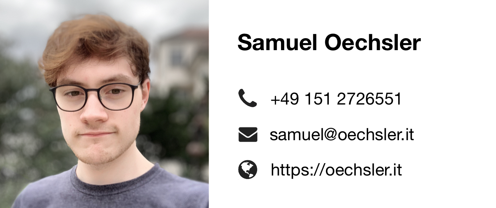

# Resume

Hi, I'm Sam. Currently, I'm with Becklyn Studios in Ludwigsburg building software as a Backend Developer.
I recently graduated from Baden-Württemberg Cooperative State University (DHBW) in Karlsruhe and earned a bachelors degree in computer science (B.Sc.). Prior to that I've been dreaming in code since pretty much the beginning of the last decade and thus have
gained roughly eight years now of *personal experience* in coding with various technologies and languages, something I 
always like to dedicate some of my free time to. Whilst studying I have also gained roughly two years of experience in 
the industry now. 

## Languages

- German &minus; native
- English &minus; fluent

## Education

- 2018 &minus; 2021 &emsp; Bachelor of Science in Applied Computer Science at Cooperative State University (DHBW)
- 2011 &minus; 2018 &emsp; Abitur at the Lise-Meitner Gymnasium in Königsbach-Stein
- 2009 &minus; 2011 &emsp; Reuchlin Gymnasium Pforzheim
- 2005 &minus; 2009 &emsp; Elmentary School Eisingen

## Experience

- 2021 &minus; **now** &emsp; Backend Developer at Becklyn GmbH in Ludwigsburg
- 2018 &minus; 2021 &emsp; Developer at medialesson GmbH in Pforzheim

### Tech related

- 2017 &emsp; Host: Creating games with Love2d &minus; "Projekttage" at Liese-Meitner Gymansium
- 2015 &emsp; Host: Creating games with Unity 3D &minus; "Projekttage" at Liese-Meitner Gymansium
- 2015 &emsp; BOGY internship at medialesson GmbH in Pforzheim
- 2014 &emsp; Internship at SYZYGY in Bad-Homburg
- 2014 &emsp; Hackathon at SYZYGY in Frankfurt
- 2013 &emsp; Hackathon at Meyle+Müller / medialesson in Pforzheim

### Non-tech related

- 2017 & 2018 &emsp; Holiday job in manufacturing at Daimler AG (Rastatt)
- 2016 &minus; 2018 &emsp; Kitchen assistant at Hotel Krone in Stein (Baden)
- 2014 &emsp; "Sozialpraktikum" at Tagespflege Eisingen

## Competences & Skills

### Programming Languages

- Go, TypeScript &minus; very confident
- PHP, C# &minus; confident

### Frameworks

- ASP.NET, Symfony &minus; very confident
- React, Vue &minus; confident

### Tools & Platforms

- Docker, Git &minus; very confident
- Azure Cloud, Kubernetes &minus; confident
- Helm, Ansible &minus; entry-level
